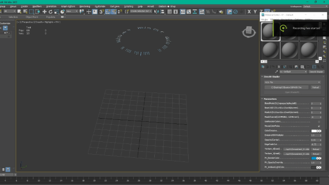
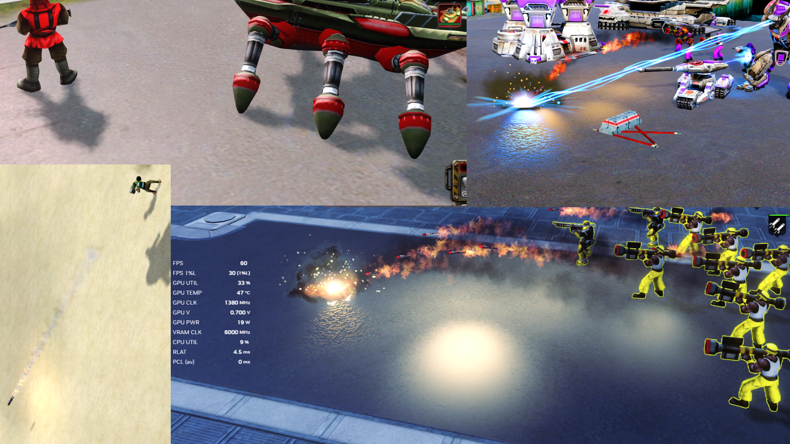
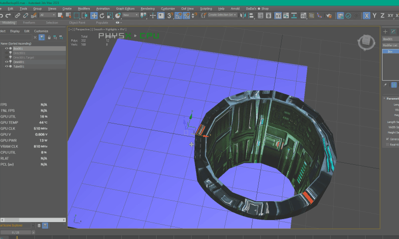
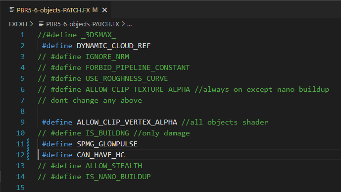
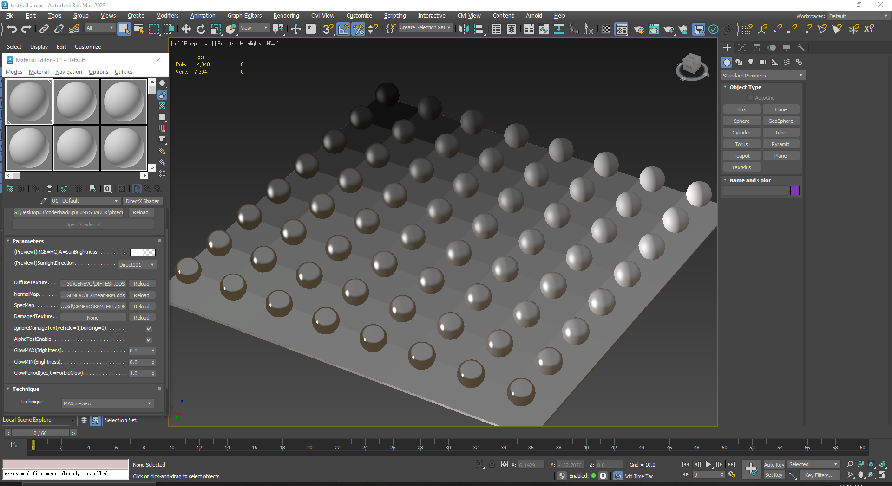
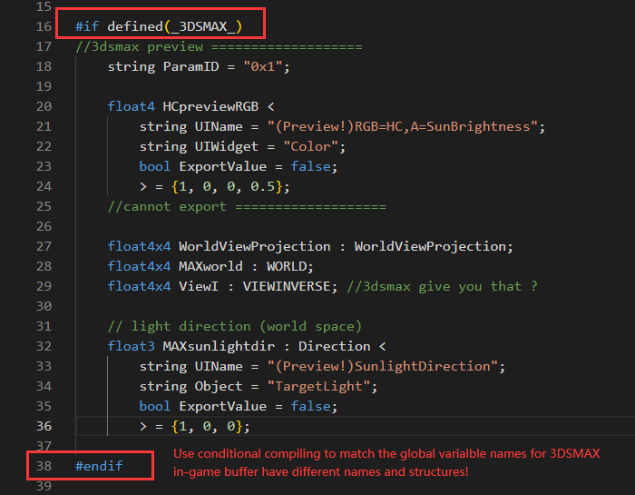
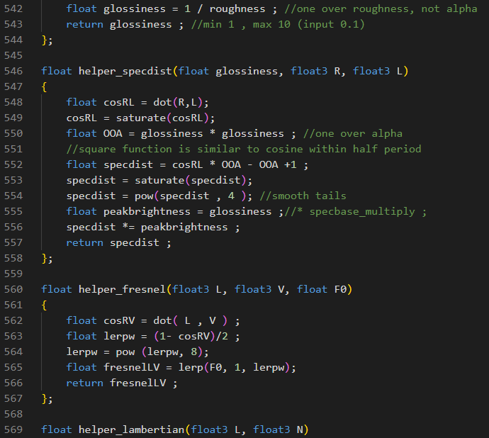
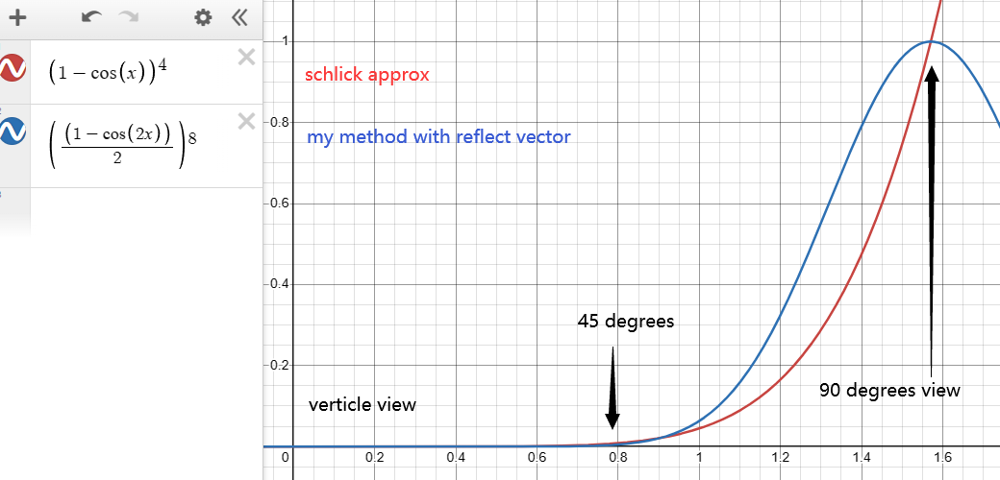
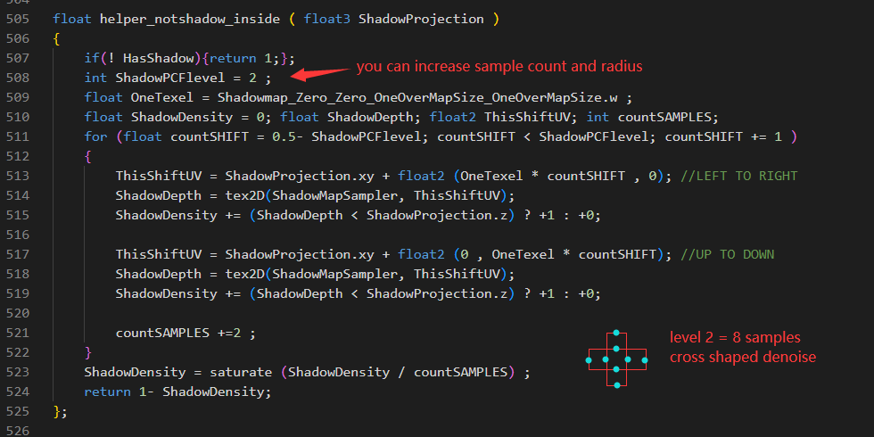

# custom-shaders-RedAlert3

Custom shader source for Command & Conquer: Red Alert 3. This repository focuses on graphic improvements for the game’s DX9 renderer, using HLSL-based shaders and a cleaner source structure that is easier to read and edit than the decompiled prototypes this project originally started from.

> Note: this is not a fork of the official EA source drop. The project began before the Red Alert 3 shader source code was published, so the layout and implementation style are intentionally different.

## Highlights

- PBR-focused object and building shaders for Red Alert 3.
- Terrain shading improvements, including smoother shadow edges and more realistic point-light reflection.
- A 3ds Max preview workflow for checking results close to in-game output.
- Optional compatibility-oriented variants for original game textures and art style.
- Experimental effects such as stealth holographic rendering, underground structure visualization, and starry portal-style VFX.



## Project Status

EA has now open-sourced the Red Alert 3 shader sources as part of the SAGE engine releases, so there is no longer a need to reverse engineer the original shaders for reference. The official source drop is here:

https://github.com/electronicarts/CnC_Modding_Support/tree/main/Red%20Alert%203/Shaders

The early prototype for this project used DXDecompiler as a reference before that source drop was available:

https://github.com/lanyizi/DXDecompiler

If you compare this repo to the official shader drop, the layout is intentionally different. It was written earlier and kept in a form that is easier for modders to edit directly.

## Download

A compiled and packed game-ready patch is available here:

https://www.moddb.com/mods/psysonic-omega/addons

Updated: April 2025, version 3.1.

## Build

Use `fxc.exe` to compile the shaders. The Red Alert 3 in-game compiler is too old for this workflow, so compile with the legacy Microsoft DirectX SDK version of `fxc.exe` instead.

Recommended workflow:

1. Place `fxc.exe` in the same folder as the `.fx` and `.fxh` files, or add it to your PATH.
2. Open a command prompt in the shader folder.
3. Run a compile command like:

```bat
fxc.exe /O2 /T fx_2_0 /Fo OutputFileName.fxo SourceFileName.fx
```

You can also use `FXFXH/compileALL.bat` to batch-compile the shaders in one click.

If you prefer the classic Windows workflow, opening CMD from the folder path bar is still the fastest way to get a shell here.

For 3ds Max workflow, the uncompiled source is required. I recommend 3ds Max 2023 with the exporter plugin in the `TOOLS` folder.

The game itself should not be used to compile these shaders; its compiler is too outdated for this source style.

## Main Shader System

The main project here is the PBR shader set, intended to replace the game’s Object and Building shaders after compilation.

The framework was rewritten in 2025 to use more efficient functions and more precise constant-register assignment. The reusable shader headers live in the `FXFXH` folder.

### Parameters

The preview and runtime shaders expose or derive the following material controls:

- diffuse color
- ambient occlusion
- insulator reflectivity
- Fresnel F0
- roughness
- metalness
- metal reflection spectrum color
- team color
- emissive color
- emissive blink frequency
- shadow-map smoothing and anti-aliasing radius
- transparency controls

These values can be driven by textures, constants, or hardcoded logic depending on the shader variant.

## Feature Notes

### Terrain Update, March 2025

The terrain pass now fixes blocky shadow edges and awkward ground displacement. Shadow filtering uses 2x2 PCF plus dithering to soften the edge.



It also supports more realistic point-light reflection.

### 3ds Max Preview, February 2025

This version adds a more complete preview pipeline so you can inspect near in-game results directly in 3ds Max. It was originally built for the 日冕 dev team.


### January 2025 Rewrite

The complete framework was rewritten with more efficient helper functions and more precise constant register assignment. No more decompiled snippets are used.

The stealth support automatically switches rendering into a semi-transparent holographic look with edge-color enhancement when opacity is below 100%.

That behavior is fully automatic, so you do not need to script a separate stealth toggle into your mod.

The underground-structure shader makes missile silos and mine pits readable without visibly breaking the terrain surface. It uses optical illusion rather than modifying the depth buffer directly, while keeping lighting, shadowing, and reflections consistent with an underground object.




The same source file can be compiled into multiple shader variants using conditional macros, similar to C++ preprocessing.



## Compatibility Variants

A special compatibility variant exists for original Red Alert 3 textures and art style. It keeps the BRDF-based lighting model while reconstructing some values through hardcoded functions and the game’s original textures.

This is the less accurate but more stylized PBR tuning, so it is the variant to use when you want the original art style to survive without texture edits.



As reflectivity increases, diffuse lighting decreases according to energy conservation. Fresnel becomes more visible at grazing angles and fades when the material is treated as metallic.

If you are editing the 3ds Max preview and want to add or remove an in-game feature, use the conditional shader logic carefully:



## Lighting Model

The older game shading path handled nearby point lights in a very simplified way. This project implements a BRDF-style response for point lights, which was originally designed for directional sunlight but works well for localized lights with the correct decay multiplier.


Up to 8 nearby point lights can be received by a single draw call per object per frame.

Specular handling uses a reflection-vector approach instead of computing a half-way vector for every light source. The shader compares the reflection vector, derived from the view vector, against the light directions. This reduces cost as light count increases and avoids some edge cases around vector normalization.

In practice this also avoids the half-way-vector divide-by-zero and flip cases that can show up when light and view directions get awkward.



The Fresnel result is intentionally stylized and less physically strict than Schlick approximation, because the art direction was preferred over exact realism.

The older screenshots and notes below are kept as archive because the same ideas are still used in the current version.



## Side Project: Starry Effect

I also explored a screen-space effect based on the pixel-shader input semantic for position. By using screen-space coordinates as a texture lookup source, the shader creates a portal-to-cosmos look inspired by a blade-style visual effect.

https://learn.microsoft.com/en-us/windows/win32/direct3dhlsl/dx-graphics-hlsl-semantics#direct3d-9-vpos-and-direct3d-10-sv_position

This shader has one variant for objects and another for laser meshes, and both are named `starry` in this repository.


Remember to register the starry-sky texture in SCRAPEO so it uses the standard annotation string address.

## Archived Notes

`ObjectWorkflow_Compatile.fx` is a compatibility-focused variant tuned to match the original Red Alert 3 textures and art style while still keeping the BRDF system. No texture edits are required to use it.


Left: original game shader. Right: new shader. The shadow edge is also smoothed and anti-aliased.



The shader does not require a skybox texture; it can simulate skybox response using the reflection vector and current roughness.

## Repository Layout

- `FXFXH/` contains the main shader sources, shared headers, and batch compile helper.
- `FXFXH/FXO/` contains compiled shader outputs.
- `preview_images/` contains screenshots and animated previews referenced in this README.
- `TOOLS/` contains helper tools, exporter resources, and shader-related utilities.
- `VFX/` contains experimental VFX shaders and related assets.

## Credits

- Electronic Arts for the original Red Alert 3 shader source release.
- The DXDecompiler project for early reference during prototyping.
- The Red Alert 3 modding community for testing, feedback, and workflow ideas.
